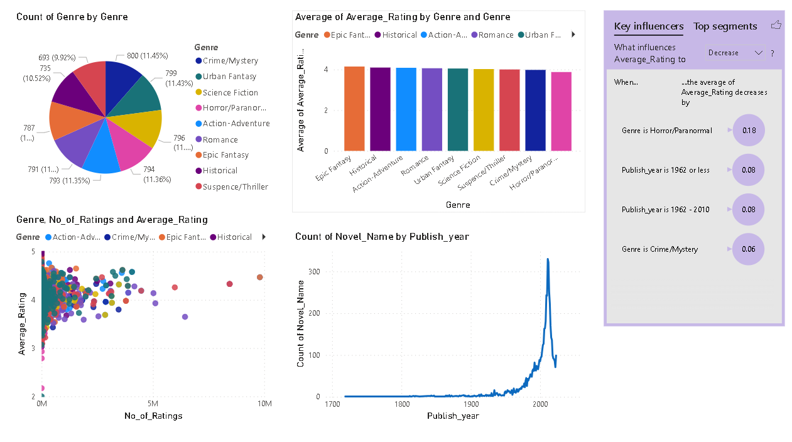

# Comprehensive Analysis to identify the Reader-Preferred Novels 

The objective of this project is to understand the dynamics of reader preferences in novels and their relationship with factors such as genre, popularity. This study aims to conduct an exploratory data analysis (EDA) on a diverse dataset of novels, analyzing factors such as reader ratings, reviews, genre classifications, and publication statistics to uncover patterns and identify the top or popular novels.

<h3>About the Dataset:</h3>

The dataset has been scraped from the "Goodreads" website. We have considered 8 genres. The dataset contains the top 800(approx.) novels which have been voted to be the best by the readers from each 8 selected genres.

There are 10 features and 6988 rows in the dataset after cleaning.

The features are:

<ul>
    <li>Novel_Name: The name of the novel.</li>
    <li>Series_Name: The name of the series the novel belongs to. If it is a standalone novel the it is represented as "-".</li>
    <li>Author_Name: The name of the author of that novel.</li>
    <li>Genre: The genre of the novel.</li>
    <li>Average_Rating: The rating of the novel, ranging from 1 to 5.</li>
    <li>No_of_Rating: The number of ratings that particular novel has.</li>
    <li>No_of_Reviews: The number of reviews that particular novel has.</li>
    <li>No_of_Votes: The number of votes given by the reader to be the best novel in that particular genre.</li>
    <li>Publish_Date: The published date of the novel.(YYYY-MM-DD)</li>
    <li>Publish_Year: The year of the publish.</li>
</ul>

